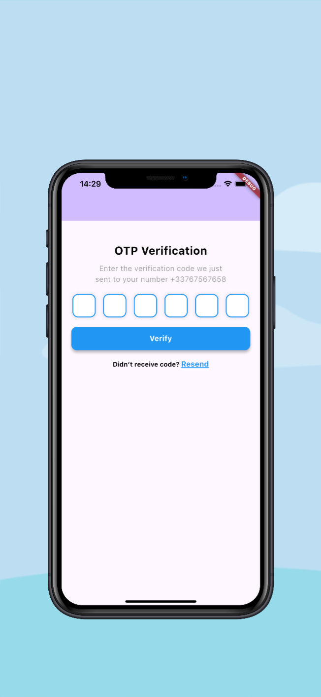
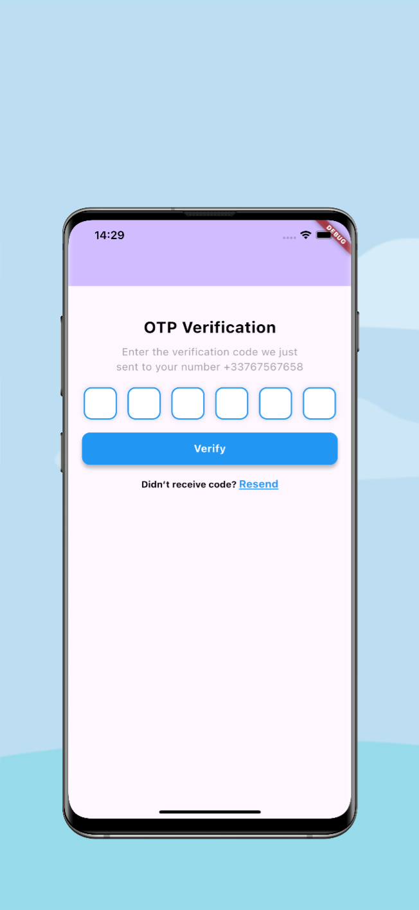

<!--
This README describes the package. If you publish this package to pub.dev,
this README's contents appear on the landing page for your package.

For information about how to write a good package README, see the guide for
[writing package pages](https://dart.dev/guides/libraries/writing-package-pages).

For general information about developing packages, see the Dart guide for
[creating packages](https://dart.dev/guides/libraries/create-library-packages)
and the Flutter guide for
[developing packages and plugins](https://flutter.dev/developing-packages).
-->

## Flutter OTP Input

The OTPInput widget is a customizable Flutter widget that allows users to input a one-time password (OTP) through a series of individual text fields. It provides an interactive UI for verifying codes, including features such as customizable title, subtitle, and error messages. The widget also supports OTP length configuration, a "Resend" button for requesting a new code, and a verification button.

## Created by [@badiniibrahim](https://github.com/badiniibrahim)

Liked some of my work? Buy me a coffee. Thanks for your support :heart:

<a href="https://buymeacoffee.com/toncopilote" target="_blank"></a>

## Screenshot

- IOS
  

- Android
  

## Features

- Customizable OTP Length: Easily adjust the number of fields for the OTP input.
- Resend Functionality: Trigger a callback function when the user requests to resend the OTP.
- Error Handling: Displays error messages if the OTP is incomplete or invalid.
- Styling: Customizable text styles, border colors, and button styles.

## Getting Started

Add the dependency to your `pubspec.yaml` file:

```yaml
dependencies:
  ...
  flutter_otp_input: latest_version
```

## Here's a complete example showcasing the usage of the Flexi Toast:

```dart
void main() {
  runApp(const MyApp());
}

class MyApp extends StatelessWidget {
  const MyApp({super.key});

  @override
  Widget build(BuildContext context) {
    return const MaterialApp(
      title: 'Flutter Demo',
      home: MyHomePage(title: ''),
    );
  }
}

class MyHomePage extends StatefulWidget {
  const MyHomePage({super.key, required this.title});

  final String title;

  @override
  State<MyHomePage> createState() => _MyHomePageState();
}

class _MyHomePageState extends State<MyHomePage> {
  @override
  Widget build(BuildContext context) {
    return Scaffold(
      appBar: AppBar(
        backgroundColor: Theme.of(context).colorScheme.inversePrimary,
        title: Text(widget.title),
      ),
      body: OTPInput(
        length: 6,
        onCompleted: (value) => print('OTP Completed: $value'),
        onChanged: (value) => print('OTP Changed: $value'),
        textStyle: const TextStyle(fontSize: 18, color: Colors.black),
        borderFieldColor: Colors.blue,
        phoneNumber: "+33767567658",
        resendStyle: const TextStyle(
          fontSize: 14,
          color: Colors.black,
          fontWeight: FontWeight.bold,
        ),
        onResend: () {
          print("Renvoi du code...");
        },
        verifyButtonColor: Colors.blue,
        errorMessage: "Code OTP invalide",
        resendTextStyle: const TextStyle(
          color: Colors.blue,
          fontSize: 16,
          fontWeight: FontWeight.bold,
          decoration: TextDecoration.underline,
        ),
      ),
    );
  }
}

```

### Parameters

- **`length`**: (optional)
  The number of fields in the OTP input. Default value is 6. This determines how many OTP digits the user is required to enter.

- **`onCompleted`** (required)
  A callback function that is called when the OTP input is completed (when all fields are filled). It returns the complete OTP entered by the user.

- **`onChanged`**: (optional)
  A callback function that is called whenever the value of the OTP changes. It provides the current input as a string of digits entered so far.

- **`borderColor`**: (optional)
  The color of the border surrounding the OTP input fields. Default value is Color(0xFFE5A048).

- **`borderFieldColor`**: (optional)
  The color of the individual field borders for each OTP input box. Default value is Color(0xFF000000).

- **`backgroundColor`**: (optional)
  The background color of the OTP input fields. Default value is Colors.white.

- **`fieldWidth`**: (optional)
  The width and height of each OTP input field. Default value is 50.

- **`borderRadius`**: (optional)
  The border radius of the OTP input fields, controlling how rounded the corners are. Default value is 12.0.

- **`textStyle`**: (optional)
  A TextStyle object to customize the font style of the OTP digits. Default style is fontSize: 20, fontWeight: FontWeight.bold, color: Colors.black.

- **`title`**: (optional)
  The title text displayed at the top of the OTP screen. Default is "OTP Verification".

- **`subtitle`**: (optional)
  The subtitle text displayed below the title, providing additional instructions. Default is "Enter the verification code we just sent to your number".

- **`resendMessage`**: (optional)
  The message displayed above the "Resend" link, typically saying something like "Didn’t receive the code?". Default is "Didn’t receive code?".

- **`titleStyle`**: (optional)
  A TextStyle object to customize the font style of the title text. Default value is fontSize: 24, fontWeight: FontWeight.bold, color: Colors.black.

- **`subtitleStyle`**: (optional)
  A TextStyle object to customize the font style of the subtitle text. Default value is fontSize: 16, color: Colors.grey.

- **`resendStyle`**: (optional)
  A TextStyle object to customize the font style of the "Resend" link text. Default value is fontSize: 14, color: Colors.orange, fontWeight: FontWeight.bold.

- **`verifyText`**: (optional)
  The text displayed on the verification button. Default value is "Verify".

- **`resendText`**: (optional)
  The text displayed for the "Resend" action. Default value is "Resend".

- **`verifyButtonColor`**: (optional)
  The background color of the verify button. Default value is Color(0xFFE5A048).

- **`errorMessage`**: (optional)
  The error message to display if the user does not fill all the fields correctly. Default value is "Please fill in all fields."

- **`onResend`**: (optional)
  A callback function that is called when the user taps on the "Resend" link. It can be used to trigger an action, such as resending the OTP.

## LinkedIn

Connect with me on [LinkedIn](https://www.linkedin.com/in/badini-ibrahim-sawadogo-306b119b/)
